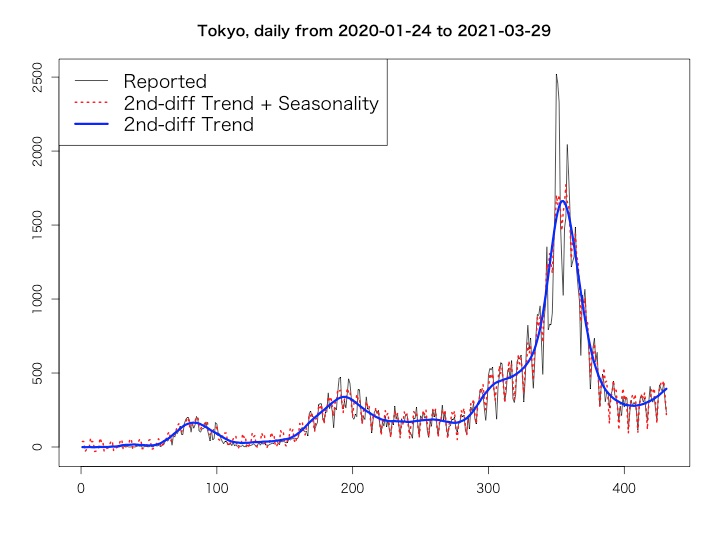

# R Package TokyoCovidMonitor
A simple RStan-based package for monitoring daily COVID-19 positive cases in Tokyo

## Overview



This package offers a simple modeling of Bayesian structure time series with RStan, for monitoring daily COVID-19 positive cases in Tokyo.

Currently, Tokyo metropolitan government announces the number of COVID-19 positive case at 3 pm [here](https://www.fukushihoken.metro.tokyo.lg.jp/) on a daily basis. `TokyoCovidMonitor` enables you to grasp the lates time-series trend of daily positive cases, just with inputting the number announced. 

## Installation

Just run as below. This package is not public on CRAN.

```
devtools::install_github('ozt-ca/TokyoCovidMonitor')
```

## Walk through

If Tokyo metropolitan government announced that the number of reported positive cases today was 100, just run as below.

```
library(TokyoCovidMonitor)
out <- stanBstsFit(100)
val <- fitValue(out)
plotOutput(val, out)
```

If you want to see the past model on such as 2021-01-01, run as below.
```
out <- stanBstsFit(lastday = "2021-01-01")
```

We would be happy if you send any feedback or comment via issues.
